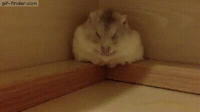

  
<pre>
    Computer Science Student • Full Stack Developer
    ⛶ Web Development • Spring Boot ⛶
    Learning about System Design
    🎮 Gaming • Anime • Music • Programming
    Coffee ☕
</pre>
 

  
    

<a href="https://cloud.layer5.io/user/f7814e2f-8fa0-4a69-8366-b29d89e8853f?tab=badges&badge=certified-meshery-contributor" alt="Certified Meshery Contributor" >

