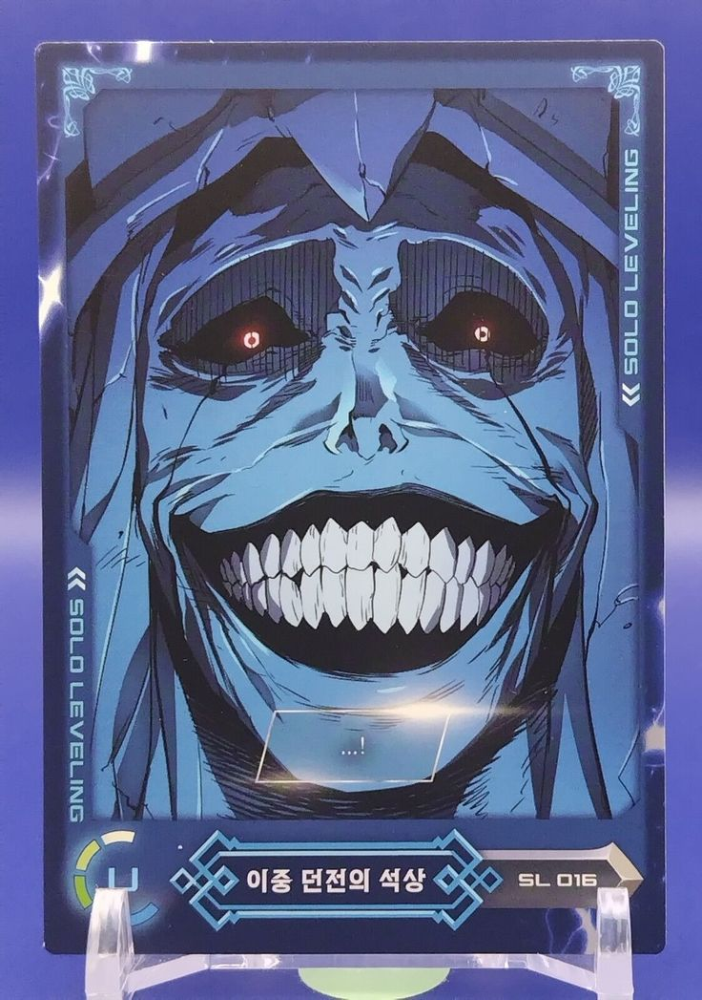
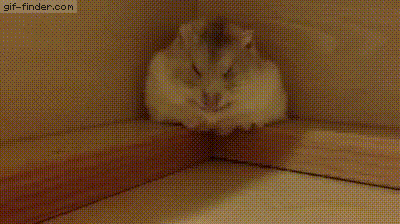

  
<pre>
    Computer Science Student • Full Stack Developer
    ⛶ Web Development • Spring Boot ⛶
    Learning about System Design
    🎮 Gaming • Anime • Music • Programming
    Coffee ☕
</pre>
 

  
    

